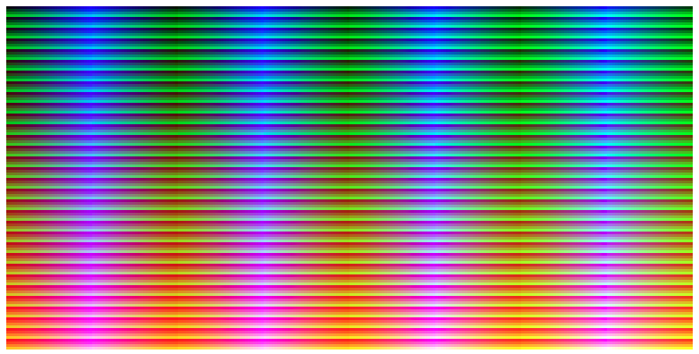

# What is Colour Pane

Colour Pane generates colours from `RGB(8, 8, 8)` to `RGB(255, 255, 255)` on a web page.



# How to use this app
It's simple. First of all you have to ensure your local machine has [yarn](https://yarnpkg.com/getting-started/install) installed. If not please click [here](https://yarnpkg.com/getting-started/install) to install yarn.

Once you have yarn installed on your local machine, please execute the following command in the same folder the `package.json` file allocated to launch the local web server.
```bash
yarn install; yarn build; yarn serve
```

Now, you can open a web browser and enter `localhost:8080` to see the result of rendering. 

Enjoy your journey.